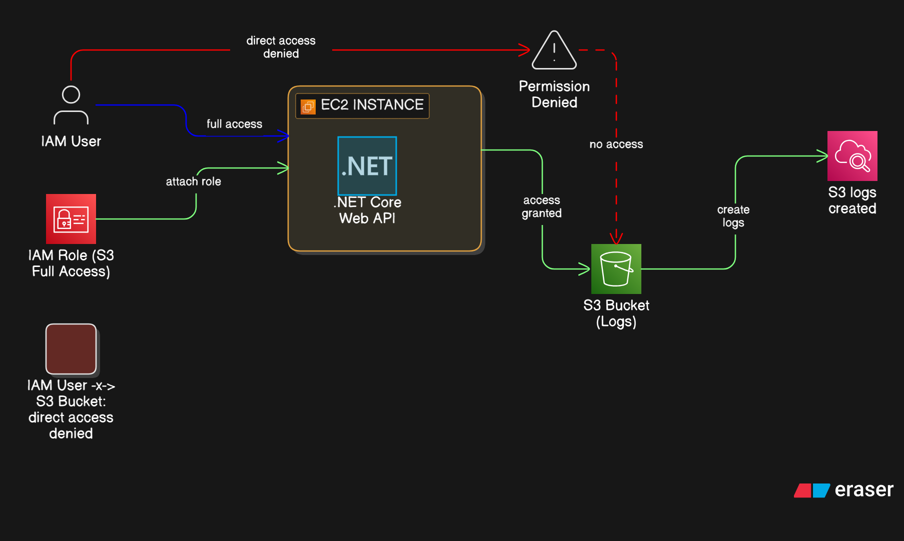

# 🔐 1. Case Study: IAM User vs. IAM Role

### **The Problem** "Access Denied" (IAM User)  
Initially, I tested the API using an IAM User with the following configuration:
* **Permissions**: `AmazonEC2FullAccess` (No S3 permissions)
* **Result**:
  - ✅ ABle to access and manage EC2 instance
  - ❌ Failed to create logs in S3 via the .NET Web API, returning a `403 Forbidden` or `AccessDenied` error
  - ❌ Failed to list buckets via AWS CL

### **Why did it fail?**   
* Even though the user had EC2 control, the Application running inside EC2 was trying to act on S3  
* Without explicit S3 permissions attached to the identity making the call, the request was blocked by the AWS Security layer.

### The Solution: Service-to-Service Authorization (IAM Role)

Instead of adding `S3` permissions to a human user or hardcoding keys into the app, I implemented the Principle of **`Least Privilege`** using an `IAM Role`.
Below are the steps for making it happen:
1. **Identity Creation**: Created an IAM Role with a Trust Relationship for the service `ec2.amazonaws.com`
2. **Granular Permissions**: Attached a policy to the role allowing `s3:PutObject` and `s3:GetBucketLocation` for the specific log bucket
3. **Resource Attachment**: Attached this role to the `EC2` instance as an Instance Profile
4. **The Result**:
   * ✅ The `.NET Web API` automatically detected the role via the `Instance Metadata Service` (IMDS)
   * ✅ API calls to `/logs` now successfully generating and uploading `.txt` log files to S3 without any code changes or stored credentials

